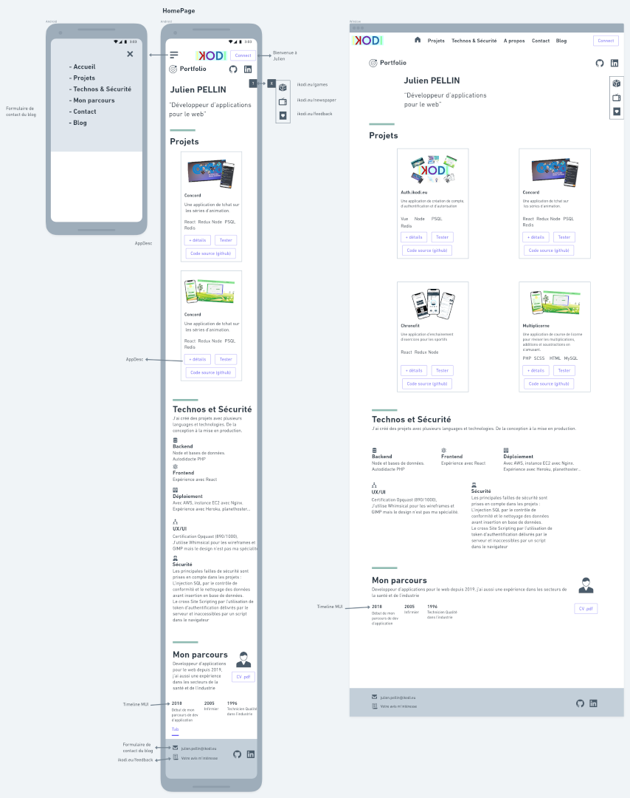

# PORTFOLIO IKODI

### Le 10/12/2021

- MVP en terme de pages :
  - HomePage, AppDesc (description d'une application), Satisfaction (intégrer le wizard form).
- wireframes :
  - HomePage :
    - Mobile -> ok
    - Desktop -> ok

- AppDesc :
  - Mobile -> ok
  - Desktop -> ok

- Fin des wireframes pour l'instant.

A faire :

- Setup repo github + app next avec un composant Hello world ->
- setup GANDI DNS,
- setup AWS Nginx,
- Deploy premier build sur AWS EC2 (voir si possible uniquement le build)

### Le 08/12/2021

Fin apprentissage de Next.js le 07/12
Recherche d'idée design pour portfolio, vu un sur yt je vais prendre les "styled components" et les "react-icons".
Modifications dans le CDC.
Début des wireframes -> vue mobile section accueil + menu hamburger + section projets

### Le 01/12/2022

Démarrage du projet de rénovation du mon portfolio.
Objectif (cf CDC) + apprendre à utiliser Next.js

Fait:

- Début d'apprentissage de Next.js
- Début écriture du CDC,
- Début d'écriture de la base de donnée sous forme objet javascript.
