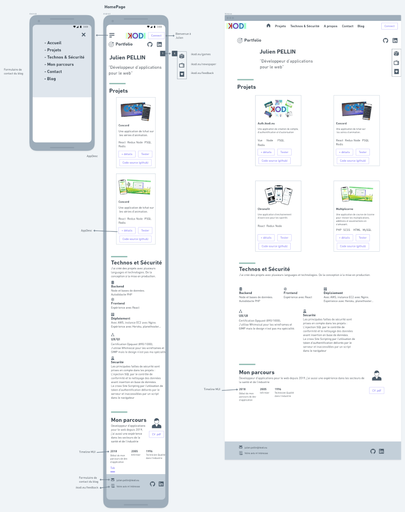
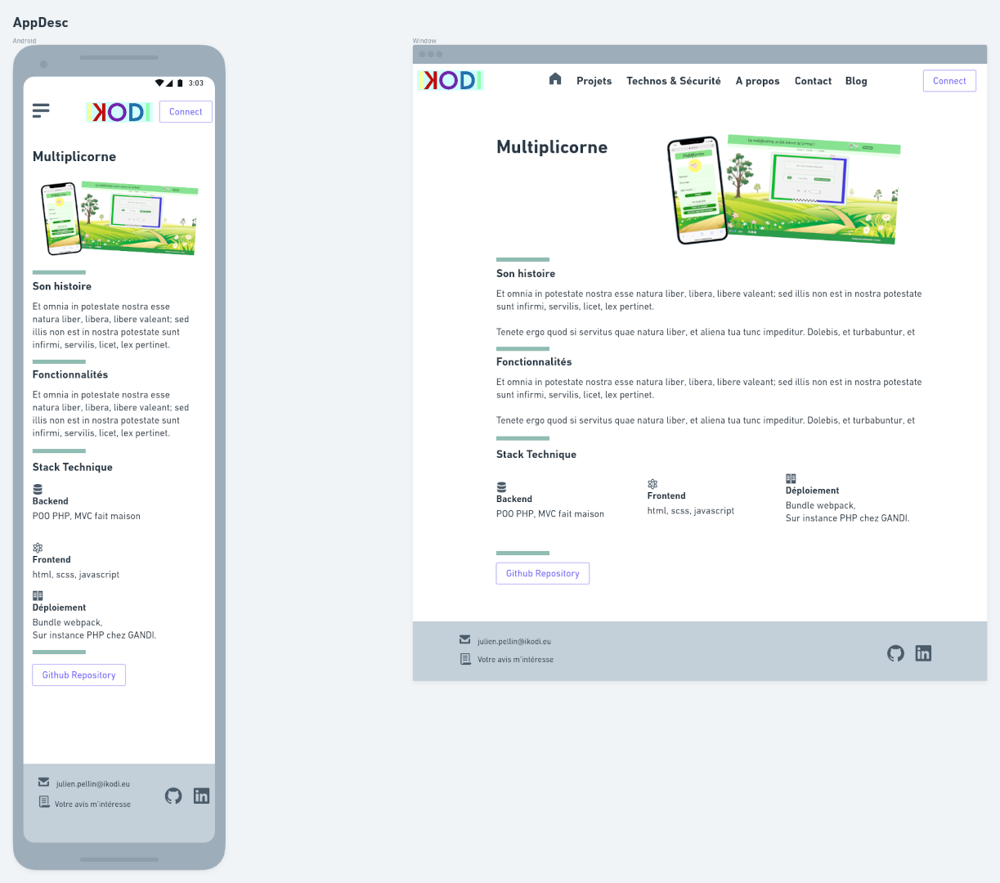

# PORTFOLIO IKODI

### le 16/12/2021

### Fait

- Vérifier les liens internes et externes -> ok
- Intégration du feedback -> en cours
- Fin mis en forme About ->
- Changement thème dark / light ->

#### Reste à faire :

- Ajouter le formulaire de feedback,
- Mettre en place les animations, transitions et styles définitifs :
  - Sur liens et boutons,
  - Sur timeline,
  - Dans section About ajouter un autre "ring" pour les xp d'avant.

### le 15/12/2021

#### Fait

- Création dynamique de la page détails d'une app, lien avec les props -> ok
- Créer les composants et sous-composant pour la page de description d'une app :
  - AppDetails -> ok (reste le css),
  - réutiliser TechCard -> non, composant AppTech -> ok
- Voir le comportement des liens dans la nav depuis AppPage -> ok (si tout pouvais être aussi simple...),
- Créer les composants communs :
  - AsideMenu ->non, devient un menu contenant des liens vers blog, jeux, app de news et formulaire de feedback -> ok (nice !)

### le 14/12/2021

#### Fait :

- TechCard, et object techList.js,
- Position fixed pour le Header,
- Du css sur les cartes,
- Galérer sur comment transmettre des composants via les props... (indice : Importe les dans le composant ou ils sont utilisés...)
- Créer les composants et sous-composants pour la Homepage :
  - Main :
    - About :
      - Timeline (voir celle de MUI) -> ok
      - Animation (à finaliser)

### le 13/12/2021

Fait :

- Mise en place de l'animation à l'accueil,
- Le Héro,
- La section Projets bien avancée,

- Créer les composants communs :
  - Header :
    - Navbar -> ok (les finitions de style seront fait globalement à la fin),
    - NavMenu mobile (hamburger) -> ok
  - Button -> ok
  - Footer -> ok
  - Divider -> ok
  - AsideMenu,
- Créer les composants et sous-composants pour la Homepage :
  - Hero -> ok
  - Title -> ok (dans Hero)
  - Main :
    - Projects :
      - ProjectCard -> ok (styles à finaliser)

### Le 12/12/2021

- Créer les composants communs (version brut) :
  - Header :
    - Navbar -> ok (les finitions de style seront fait globalement à la fin),
    - NavMenu mobile (hamburger) -> ok
  - Button -> ok

### Le 11/12/2021

- Se renseigner sur:

  - react-styled-component -> ok (et c'est pas un petit morceau, mais 👍)
  - react-icons -> ok, c'est parfait.
  - \_document de Next -> ok https://nextjs.org/docs/advanced-features/custom-document

- Créer les composants communs :
  - Header :
    - Navbar -> En cours,

### Le 10/12/2021

- MVP en terme de pages :
  - HomePage, AppDesc (description d'une application), Satisfaction (intégrer le wizard form).
- wireframes :
  - HomePage :
    - Mobile -> ok
    - Desktop -> ok

- AppDesc :
  - Mobile -> ok
  - Desktop -> ok

- Fin des wireframes pour l'instant.
- Setup repo github + app next avec un composant Hello world -> ok
- setup GANDI DNS -> ok
- Deploy premier build sur AWS EC2 -> ok (master)
- setup AWS Nginx -> ok (ne pas oublier que j'ai un fichier 'upstream' incompatible avec la config auto de certbot !!)

### Le 08/12/2021

Fin apprentissage de Next.js le 07/12
Recherche d'idée design pour portfolio, vu un sur yt je vais prendre les "styled components" et les "react-icons".
Modifications dans le CDC.
Début des wireframes -> vue mobile section accueil + menu hamburger + section projets

### Le 01/12/2022

Démarrage du projet de rénovation du mon portfolio.
Objectif (cf CDC) + apprendre à utiliser Next.js

Fait:

- Début d'apprentissage de Next.js
- Début écriture du CDC,
- Début d'écriture de la base de donnée sous forme objet javascript.
